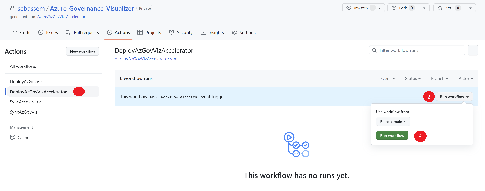

# Azure Governance Visualizer (AzGovViz) Accelerator

## Description

[Azure Governance Visualizer](https://github.com/JulianHayward/Azure-MG-Sub-Governance-Reporting) is a PowerShell based script that iterates your Azure Tenant´s Management Group hierarchy down to Subscription level. It captures most relevant Azure governance capabilities such as Azure Policy, RBAC and Blueprints and a lot more. From the collected data Azure Governance Visualizer provides visibility on your HierarchyMap, creates a TenantSummary, creates DefinitionInsights and builds granular ScopeInsights on Management Groups and Subscriptions. This accelerator speeds up the adoption of the script into your environment.

## Table of Contents

- [Azure Governance Visualizer (AzGovViz) Accelerator](#azure-governance-visualizer-azgovviz-accelerator)
  - [Description](#description)
  - [Table of Contents](#table-of-contents)
  - [Prerequisites](#prerequisites)
    - [1. Create a Service Principal (Azure AD app registration) to run AzGovViz](#1-create-a-service-principal-azure-ad-app-registration-to-run-azgovviz)
      - [Azure Portal](#azure-portal)
      - [PowerShell](#powershell)
    - [2. Create the GitHub repository](#2-create-the-github-repository)
      - [GitHub](#github)
      - [PowerShell](#powershell-1)
    - [3. Configure federated credentials for the Service Principal](#3-configure-federated-credentials-for-the-service-principal)
      - [Azure Portal](#azure-portal-1)
      - [PowerShell](#powershell-2)
    - [4. Grant permissions in Azure for the AzGovViz service principal](#4-grant-permissions-in-azure-for-the-azgovviz-service-principal)
      - [Azure Portal](#azure-portal-2)
      - [PowerShell](#powershell-3)
    - [5. Create an Azure AD application for AAD authentication for the Azure Web App](#5-create-an-azure-ad-application-for-aad-authentication-for-the-azure-web-app)
      - [Azure Portal](#azure-portal-3)
      - [PowerShell](#powershell-4)
    - [6. Create a Resource Group and assign the right RBAC Roles](#6-create-a-resource-group-and-assign-the-right-rbac-roles)
      - [Azure Portal](#azure-portal-4)
      - [PowerShell](#powershell-5)
    - [7. Create the GitHub secrets, variables and permissions](#7-create-the-github-secrets-variables-and-permissions)
      - [GitHub](#github-1)
      - [PowerShell](#powershell-6)
  - [How to deploy](#how-to-deploy)
  - [Configuration](#configuration)
    - [Azure Web App configuration](#azure-web-app-configuration)
    - [Keeping Azure Governance Visualizer code up-to-date](#keeping-azure-governance-visualizer-code-up-to-date)
    - [keeping the Azure Governance Visualizer Accelerator code up-to-date](#keeping-the-azure-governance-visualizer-accelerator-code-up-to-date)
  - [Sources to documentation](#sources-to-documentation)

## Prerequisites

### 1. Create a Service Principal (Azure AD app registration) to run AzGovViz

#### Azure Portal

>NOTE
>To grant API permissions and grant admin consent for the directory, you must have 'Privileged Role Administrator' or 'Global Administrator' role assigned [Assign Azure AD roles to users](https://docs.microsoft.com/azure/active-directory/roles/manage-roles-portal)

- Navigate to 'Azure Active Directory'
- Click on '__App registrations__'
- Click on '__New registration__'
- Name your application (e.g. _AzureGovernanceVisualizer_SP_)
- Click '__Register__'
- Your App registration has been created, in the '__Overview__' copy the '__Application (client) ID__' as we will need it later to setup the secrets in GitHub
- Under '__Manage__' click on '__API permissions__'
  - Click on '__Add a permissions__'
    - Click on '__Microsoft Graph__'
    - Click on '__Application permissions__'
    - Select the following set of permissions and click '__Add permissions__'
      - __Application / Application.Read.All__
        - __Group / Group.Read.All__
        - __User / User.Read.All__
        - __PrivilegedAccess / PrivilegedAccess.Read.AzureResources__
    - Click on 'Add a permissions'
    - Back in the main '__API permissions__' menu you will find permissions with status 'Not granted for...'. Click on '__Grant admin consent for _TenantName___' and confirm by click on '__Yes__'
    - Now you will find the permissions with status '__Granted for _TenantName___'

    

#### PowerShell

>NOTE
>To grant API permissions and grant admin consent for the directory, you must have 'Privileged Role Administrator' or 'Global Administrator' role assigned [Assign Azure AD roles to users](https://docs.microsoft.com/azure/active-directory/roles/manage-roles-portal)

- Install [AzAPICall](https://github.com/JulianHayward/AzAPICall) and connect to Azure

    ```POWERSHELL
    Install-Module -Name AzAPICall
    Connect-AzAccount
    ```

- Initialize AzAPICall

    ```POWERSHELL
    $parameters4AzAPICallModule = @{
       #SubscriptionId4AzContext = $null #specify Subscription Id
       #DebugAzAPICall = $true
       #WriteMethod = 'Output' #Debug, Error, Host, Information, Output, Progress, Verbose, Warning (default: host)
       #DebugWriteMethod = 'Warning' #Debug, Error, Host, Information, Output, Progress, Verbose, Warning (default: host)
       #SkipAzContextSubscriptionValidation = $true #Use if the account doesn´t have any permissions on Management Groups, Subscriptions, Resource Groups or Resources
    }

    $azAPICallConf = initAzAPICall @parameters4AzAPICallModule
    ```

- Define variables

    ```POWERSHELL
    $MicrosoftGraphAppId = "00000003-0000-0000-c000-000000000000"
    $AzGovVizAppName = "<App registration name that will be used to run AzGovViz>"
    ```

- Get Microsoft Graph permissions role Ids and create app registration

```POWERSHELL
$apiEndPoint = $azAPICallConf['azAPIEndpointUrls'].MicrosoftGraph
$apiEndPointVersion = '/v1.0'
$api = '/servicePrincipals'
$optionalQueryParameters = "?`$filter=(displayName eq 'Microsoft Graph')&$count=true&"

$uri = $apiEndPoint + $apiEndPointVersion + $api + $optionalQueryParameters

$azAPICallPayload = @{
    uri= $uri
    method= 'GET'
    currentTask= "'$($azAPICallConf['azAPIEndpoints'].($apiEndPoint.split('/')[2])) API: Get - Groups'"
    consistencyLevel= 'eventual'
    noPaging= $true
    AzAPICallConfiguration = $azAPICallConf
    }

    $graphApp = AzAPICall @azAPICallPayload
    $appRole = $graphApp.appRoles | Where-Object { $_.value -eq 'Application.Read.All' } | Select-Object -ExpandProperty id
    $userRole = $graphApp.appRoles | Where-Object { $_.value -eq 'User.Read.All' } | Select-Object -ExpandProperty id
    $groupRole = $graphApp.appRoles | Where-Object { $_.value -eq 'Group.Read.All' } | Select-Object -ExpandProperty id
    $pimRole = $graphApp.appRoles | Where-Object { $_.value -eq 'PrivilegedAccess.Read.AzureResources' } | Select-Object -ExpandProperty id

$body = @"
    {
    "DisplayName":"$AzGovVizAppName",
    "requiredResourceAccess" : [
    {
    "resourceAppId" : "$MicrosoftGraphAppId",
    "resourceAccess": [
    {
    "id": "$appRole",
    "type": "Role"
    },
    {
    "id": "$userRole",
    "type": "Role"
    },
    {
    "id": "$groupRole",
    "type": "Role"
    },
    {
    "id": "$pimRole",
    "type": "Role"
    }
    ]
    }
    ]
    }
"@

$AzGovVizAppObjectId = (AzAPICall -method POST -body $body -uri "$($azAPICallConf['azAPIEndpointUrls'].MicrosoftGraph)/v1.0/applications" -AzAPICallConfiguration $azAPICallConf -listenOn 'Content' -consistencyLevel 'eventual').id

do {
    Write-Host "Waiting for the AzGovViz service principal to get created..."
    Start-Sleep -seconds 20
    $AzGovVizAppId = (AzAPICall -method GET -uri "$($azAPICallConf['azAPIEndpointUrls'].MicrosoftGraph)/v1.0/applications/$AzGovVizAppObjectId" -AzAPICallConfiguration $azAPICallConf -listenOn 'Content' -consistencyLevel 'eventual' -skipOnErrorCode 404).appId
} until ($null -ne $AzGovVizAppId)

Write-host "AzGovViz service principal created successfully."

```

- Grant admin consent using the Azure AD portal

  

### 2. Create the GitHub repository

#### GitHub

- Navigate to the accelerator [GitHub repository](https://github.com/azure/Azure-Governance-Visualizer-Accelerator)
- Create a [new repository from the accelerator template](https://docs.github.com/repositories/creating-and-managing-repositories/creating-a-repository-from-a-template#creating-a-repository-from-a-template)

    

    

>NOTE
> The new repository's visibility needs to be set as Private.

#### PowerShell

- [Install GitHub CLI](https://github.com/cli/cli#installation)

- Login to your GitHub account

    ```POWERSHELL
    gh auth login
    ```

- Create a private repository from the Accelerator template

    ```POWERSHELL
    ### Define variables
    $directoryToCloneAccelerator = "<Local directory to clone the Accelerator's repository>"
    $GitHubOrg = "<GitHub organization to use>"
    $GitHubRepository = "Azure-Governance-Visualizer"

    ### Create a new repository from template
    gh repo create $GitHubRepository --template Azure/Azure-Governance-Visualizer-Accelerator --private
    New-Item -ItemType Directory -Path $directoryToCloneAccelerator -Force
    cd $directoryToCloneAccelerator
    gh repo clone "$GitHubOrg/$GitHubRepository"
    Set-Location $GitHubRepository

    ```

### 3. Configure federated credentials for the Service Principal

#### Azure Portal

Navigate to 'Azure Active Directory'

- Click on '__App registrations__'
- Search for the Application that we created earlier and click on it
- Under '__Manage__' click on '__Certificates & Secrets__'
- Click on '__Federated credentials__'
- Click 'Add credential'
- Select Federation credential scenario 'GitHub Actions deploying Azure Resources'
- Fill the field 'Organization' with your GitHub Organization name
- Fill the field 'Repository' with your GitHub repository name
- For the entity type select 'Branch'
- Fill the field 'GitHub branch name' with your branch name
- Fill the field 'Name' with a name (e.g. AzureGovernanceVisualizer_GitHub_Actions)
- Click 'Add'

#### PowerShell

  ```POWERSHELL
  $gitHubRef= ":ref:refs/heads/main"
  $subject = "repo:$gitHubOrg/$GitHubRepository$gitHubRef"
  $body = @"
  {
    "audiences": [
    "api://AzureADTokenExchange"
    ],
    "subject":"$subject",
    "issuer":"https://token.actions.githubusercontent.com",
    "name":"AzGovVizCreds"
    }
"@

AzAPICall -method POST -body $body -uri "$($azAPICallConf['azAPIEndpointUrls'].MicrosoftGraph)/v1.0/applications/$AzGovVizAppObjectId/federatedIdentityCredentials" -AzAPICallConfiguration $azAPICallConf -listenOn 'Content' -consistencyLevel 'eventual'
  ```

### 4. Grant permissions in Azure for the AzGovViz service principal

#### Azure Portal

>NOTE
>To assign roles, you must have '__Microsoft.Authorization/roleAssignments/write__' permissions on the target Management Group scope (such as the built-in RBAC Role '__User Access Administrator__' or '__Owner__')

- Create a '__Reader__' [RBAC Role assignment](https://docs.microsoft.com/azure/role-based-access-control/role-assignments-portal) on the target Management Group scope for the identity that shall run Azure Governance Visualizer

#### PowerShell

  ```POWERSHELL
    $role = "Reader"
    $managementGroupId = "<managementGroupId>"
    New-AzRoleAssignment `
    -ApplicationId $AzGovVizAppId `
    -RoleDefinitionName $role `
    -Scope /providers/Microsoft.Management/managementGroups/$managementGroupId
  ```

### 5. Create an Azure AD application for AAD authentication for the Azure Web App

#### Azure Portal

- Create an [app registration](https://learn.microsoft.com/azure/app-service/configure-authentication-provider-aad#-step-1-create-an-app-registration-in-azure-ad-for-your-app-service-app) in Azure AD for your Azure App Web app

#### PowerShell

  ```POWERSHELL
    # 2-60 Alphanumeric, hyphens and Unicode characters.Can't start or end with hyphen. A web site must have a globally unique name
    $webAppName = "<Azure Web App name to publish AzGovViz>"
    $WebApplicationAppName = "<App registration name that will be used to add Azure AD authentication to the web app>"

    $body = @"
    {
    "DisplayName":"$WebApplicationAppName",
    "web":
    {
    "redirectUris": [
    "https://$webAppName.azurewebsites.net/.auth/login/aad/callback"
    ],
    "implicitGrantSettings":
    {
    "enableIdTokenIssuance": true
    }
    }
    }
"@

$webAppSP = AzAPICall -method POST -body $body -uri "$($azAPICallConf['azAPIEndpointUrls'].MicrosoftGraph)/v1.0/applications" -AzAPICallConfiguration $azAPICallConf -listenOn 'Content' -consistencyLevel 'eventual'
$webAppSPAppId = $webAppSP.appId
$webAppSPObjectId = $webAppSP.Id

do {
    Write-Host "Waiting for the Azure WebApp app registration to get created..."
    Start-Sleep -seconds 20
    $webApp = AzAPICall -uri "$($azAPICallConf['azAPIEndpointUrls'].MicrosoftGraph)/v1.0/applications/$webAppSPObjectId" -AzAPICallConfiguration $azAPICallConf -listenOn 'Content' -consistencyLevel 'eventual'

} until ( $null -ne $webApp)

Write-host "Azure WebApp app registration created successfully."

    #### Add an API scope for the Web App
    $body = @"
    {
        "identifierUris" : [
        "api://$webAppSPAppId"
        ],
        "api":
        {
            "oauth2PermissionScopes": [
                {
                    "value": "user_impersonation",
                    "adminConsentDescription": "AzGovViz Web App Azure AD authentication",
                    "adminConsentDisplayName": "AzGovViz Web App Azure AD authentication",
                    "type": "User",
                    "id": "$webAppSPAppId"
                }
            ]
        }
    }
"@


AzAPICall -method PATCH -body $body -uri "$($azAPICallConf['azAPIEndpointUrls'].MicrosoftGraph)/v1.0/applications/$webAppSPObjectId" -AzAPICallConfiguration $azAPICallConf -listenOn 'Content' -consistencyLevel 'eventual'

    #### Generate client secret
    $body = @"
    {
    "passwordCredential":{
    "displayName": "AzGovVizWebAppSecret"
    }
    }
"@

$webAppSPAppSecret = (AzAPICall -method POST -body $body -uri "$($azAPICallConf['azAPIEndpointUrls'].MicrosoftGraph)/v1.0/applications/$webAppSPObjectId/addPassword" -AzAPICallConfiguration $azAPICallConf -listenOn 'Content' -consistencyLevel 'eventual').secretText
  ```

### 6. Create a Resource Group and assign the right RBAC Roles

#### Azure Portal

>NOTE
>To assign roles, you must have '__Microsoft.Authorization/roleAssignments/write__' permissions on the target Management Group scope (such as the built-in RBAC Role '__User Access Administrator__' or '__Owner__')

- Create a [new Resource Group](https://learn.microsoft.com/azure/azure-resource-manager/management/manage-resource-groups-portal#create-resource-groups) in Azure
- [Assign the following roles](https://learn.microsoft.com/azure/role-based-access-control/role-assignments-portal) to the AzGovViz Service Principal the on the newly created Resource Group.
  - [Website Contributor](https://learn.microsoft.com/azure/role-based-access-control/built-in-roles#website-contributor)
  - [Web Plan Contributor](https://learn.microsoft.com/azure/role-based-access-control/built-in-roles#web-plan-contributor)

#### PowerShell

>NOTE
>To assign roles, you must have '__Microsoft.Authorization/roleAssignments/write__' permissions on the target Management Group scope (such as the built-in RBAC Role '__User Access Administrator__' or '__Owner__')

  ```POWERSHELL
    $resourceGroupName = "Name of the Resource Group where the Azure Web App will be created>"
    $location = "<Azure Region for the Azure Web App>"

    New-AzResourceGroup -Name $resourceGroupName -Location $location
    New-AzRoleAssignment -ApplicationId $AzGovVizAppId -RoleDefinitionName "Web Plan Contributor" -ResourceGroupName $resourceGroupName
    New-AzRoleAssignment -ApplicationId $AzGovVizAppId -RoleDefinitionName "WebSite Contributor" -ResourceGroupName $resourceGroupName

  ```

### 7. Create the GitHub secrets, variables and permissions

#### GitHub

- Create the following [GitHub secrets](https://docs.github.com/actions/security-guides/encrypted-secrets#creating-encrypted-secrets-for-a-repository) on the repository

| Secret                  | Value                                                                                                |
| ----------------------- | ---------------------------------------------------------------------------------------------------- |
| __CLIENT_ID__           | objectId of the identity that shall run Azure Governance Visualizer                                  |
| __AAD_CLIENT_ID__       | objectId of the identity that will be used to configure Azure AD authentication to the Azure Web App |
| __AAD_CLIENT_SECRET__   | secret of the identity that will be used to configure Azure AD authentication to the Azure Web App   |
| __SUBSCRIPTION_ID__     | Subscription Id                                                                                      |
| __TENANT_ID__           | Tenant Id                                                                                            |
| __MANAGEMENT_GROUP_ID__ | Management group Id                                                                                  |

- Create the following [GitHub variables](https://docs.github.com/actions/learn-github-actions/variables#creating-configuration-variables-for-an-organization) on the repository

| Variable                | Value                                                            |
| ----------------------- | ---------------------------------------------------------------- |
| __RESOURCE_GROUP_NAME__ | Name of the pre-created resource group to host the Azure Web App |
| __WEB_APP_NAME__        | Globally unique name of the Azure Web App                        |

- Enable GitHub actions to [create and approve pull requests](https://docs.github.com/repositories/managing-your-repositorys-settings-and-features/enabling-features-for-your-repository/managing-github-actions-settings-for-a-repository#preventing-github-actions-from-creating-or-approving-pull-requests) on the repository.

#### PowerShell

- Create the needed secrets, variables and permissions

    ```POWERSHELL
    ### Define variables
    $subscriptionId = "<Subscription Id>"
    $tenantId = "<Tenant Id>"
    $managementGroupId = $managementGroupId
    $resourceGroupName = $resourceGroupName
    $clientId = $AzGovVizAppId
    $aadClientId = $webAppSPAppId
    $aadClientSecret = $webAppSPAppSecret

    ### Create GitHub repository secrets and variables
    gh secret set 'CLIENT_ID' -b $clientId
    gh secret set 'AAD_CLIENT_ID' -b $aadClientId
    gh secret set 'AAD_CLIENT_SECRET' -b $aadClientSecret
    gh secret set 'SUBSCRIPTION_ID' -b $subscriptionId
    gh secret set 'TENANT_ID' -b $tenantId
    gh secret set 'MANAGEMENT_GROUP_ID' -b $managementGroupId
    gh variable set 'RESOURCE_GROUP_NAME' -b $resourceGroupName
    gh variable set 'WEB_APP_NAME' -b $webAppName

    ### Configure GitHub actions permissions
    gh api -X PUT /repos/$GitHubOrg/$GitHubRepository/actions/permissions/workflow -F can_approve_pull_request_reviews=true
    ```

## How to deploy

To deploy the accelerator after having the pre-requisites ready, you need to perform the following steps:

- Navigate to _Actions_ in your newly created repository

    

- Run the _DeployAzGovVizAccelerator_ workflow to initialize the accelerator, deploy the Azure Web App and configure Azure AD authentication for it

    

    

- This workflow will trigger another workflow to sync the latest AzGovViz code to your repository

    

- You will have to add the [AzGovViz parameters](https://github.com/JulianHayward/Azure-MG-Sub-Governance-Reporting#parameters) you need into the _DeployAzGovViz_ workflow and enable the schedule option if you want to continuously run Azure Governance Visualizer.

    

    

    

- As an example, I will add the _NoPIMEligibility_ parameter since I don't have PIM

    

- Then, run the _DeployAzGovViz_ workflow to deploy AzGovViz and publish it to the Azure Web App

    

    

    

    

## Configuration

### Azure Web App configuration

- You can configure some aspects of the Azure Web application where AzGovViz is published by editing the _webApp.parameters.json_ file in the _bicep_ folder.

    

### Keeping Azure Governance Visualizer code up-to-date

- To keep the Azure Governance Visualizer's code up-to-date, the workflow _SyncAzGovViz_ runs on a schedule to check for new versions. The default setting is that this is enabled to push updates automatically to your repository. If you need to control those new version updates, you will have to set _AutoUpdateAzGovViz_ to false so you would get a Pull Request every time there is a new version to review.

    

### keeping the Azure Governance Visualizer Accelerator code up-to-date

- To keep the Azure Governance Visualizer Accelerator code up-to-date, the workflow _SyncAccelerator_ runs on a schedule to check for new versions. Everytime there is a new update to the accelerator's code, you would get a Pull Request submitted to your repository and the new release will be merged to a _releases_ folder where you can move to newer versions of this accelerator at your own pace.

## Sources to documentation

For more information on Azure Governance Visualizer, please visit the [official docs](https://github.com/JulianHayward/Azure-MG-Sub-Governance-Reporting).
